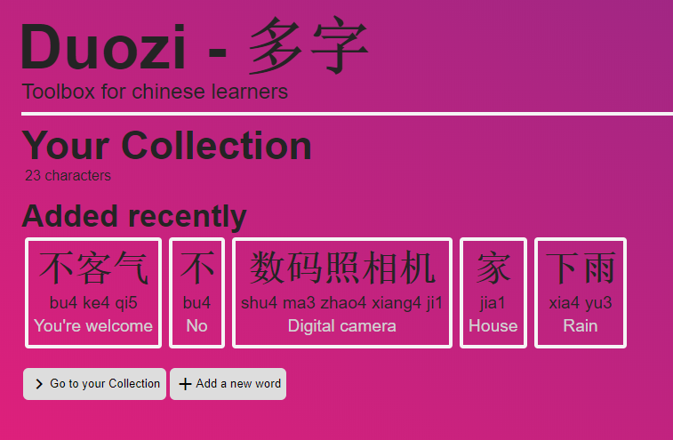

Buen readme, explicativo y claro.

# Duozi
Web application tool for early mandarin learners.
This application allows you to store the chinese words you have learned and also provides useful tools, like pinyin search from Hanzi, or viceversa. It also includes a dictionary search allowing searching by meaning, pinyin or hanzi (characters) and a chinese text recognition (or extraction) tool from images [OCR]. 

It's main purpose is to help early chinese learners in keeping track of their learned characters and to provide them tools to enhance their learning.

It is made with React for the frontend and Express.js with MongoDB for the backend. The React project is located in the `./frontend` folder. The final app has been deployed to heroku: http://duozi.herokuapp.com/ for public usage.

## How to run it
To run this project, you need to have npm or yarn installed. In this case, we will detail instructions for npm:

 - Message Sergio Cárdenas or Julián Manrique vía Slack or email (se.cardenas@uniandes.edu.co and ja.manrique@uniandes.edu.co) in order to get .env file with API keys or raw values for environment variables. If using the .env file, place it on the root directory after cloning the repository.  

 - Clone the project from the github repository:  
 `git clone https://github.com/Sxubas/duozi-web.git`  
 `cd duozi-web`  
 
 - Install backend project dependencies and run:  
 `npm install`  
 `node index.js`  
 
 - Install frontend project dependencies and run:  
 `cd ./frontend`  
 `npm install`  
 `npm start`  

Afterwards, both projects will be running. Backend API calls are bibnded to `localhost:8080` and frontend development server is binded to `localhost:3000`. Requesting `localhost:3000` through browser will run the app as it is on heroku (It proxies it's requests to `localhost:8080`).

## Authors
[Julián Manrique](https://github.com/Sxubas)

[Sergio Cárdenas](https://github.com/SeCardenas)

## Preview

